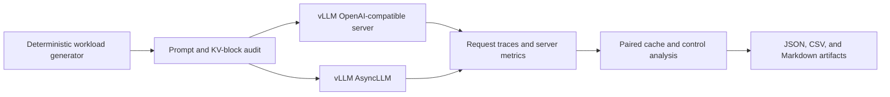

# Controlled vLLM Serving Experiments

A reproducible study of prefix-cache behavior and tensor-parallel serving tradeoffs.

This repository contains a benchmark harness for paired cache-on/cache-off experiments across the vLLM OpenAI-compatible server and in-process `AsyncLLM` paths. It records request-level timing, direct prefix-cache counters, GPU KV-cache capacity, and reproducible JSON/CSV/Markdown artifacts.

The experiments isolate two systems questions: when does shared-prefix reuse
produce a measurable serving benefit, and what changes when a 7B model moves
from one L4 to two tensor-parallel L4s?

## Prefix-cache result

The strongest server experiment uses `Qwen/Qwen2.5-1.5B-Instruct` on an NVIDIA L4 with 32 unique requests. The shared-prefix and matched unique-prefix workloads have comparable prompt shapes; the control contains no exact duplicate prompts.

At the lowest successful KV budget (`gpu_memory_utilization=0.325`):

| Workload | Cache hit rate | Throughput, cache on/off | p95 latency, cache on/off |
| --- | ---: | ---: | ---: |
| Shared prefix | 96.204% | 10.741x | 0.095x |
| Matched unique prefix | 0.442% | 0.975x | 1.026x |

Prefix caching reduced p95 latency by 90.5% and increased throughput by 10.7x for the shared-prefix stress workload. The matched control stayed near baseline, which rules out a generic cache-enabled speedup as the explanation.

The result was replicated across two seeds at each successful memory-budget point. The same workload failed vLLM initialization at `gpu_memory_utilization=0.300`, bounding the observed startup floor between `0.300` and `0.325` for this model and serving configuration.

See the [KV-budget report](results/modal-vllm-server-async-qwen15b-l4-kvbudget-report-r1/kv-budget-report.md) for the claim/evidence matrix and the [pressure curve](results/modal-vllm-server-async-qwen15b-l4-kvbudget-gpu045-gpu040-gpu035-gpu0325-n32-batched-tokens60640-seed3805-seed3906-pressure-curve-r1/server-cache-pressure-curve.md) for every measured point.

## Tensor-parallel result

A matched `Qwen/Qwen2.5-7B-Instruct` study compared one L4 with two
tensor-parallel L4s under the same long-context, cache-disabled workload. Across
two independent Modal run/seed trials and six paired repeats, TP2 increased
server throughput by 29.4% and reduced p95 latency by 22.6%. The hierarchical
90% intervals were 1.240x to 1.361x for throughput and 0.735x to 0.806x for p95
latency.

vLLM reported 81,784 to 81,785 KV-cache tokens for TP1 and 445,325 to 445,331
for TP2, a 5.445x increase in total KV capacity. The two-GPU workers lacked GPU
P2P/custom all-reduce and used NCCL fallback. This is a topology result, not a
cost-efficiency claim: two GPUs delivered 1.294x median server throughput, so
throughput per GPU decreased.

See the [replicated tensor-parallel report](results/tensor-parallel-qwen7b-l4-multitrial-r6/tensor-parallel-multitrial.md) for the trial-level capacity measurements, request-path results, and interpretation boundary.

## What the benchmark controls

- Cache enabled versus disabled for the same workload.
- Shared-prefix traffic versus a length-matched unique-prefix control.
- Stable request count, output length, model, GPU class, and scheduler budget.
- Phase order, neutral warmup, prompt identity, and random seed.
- Direct cache-hit counters rather than latency-only inference.
- Exact-duplicate and reusable-block audits for every prompt family.

These controls matter because prefix-cache benchmarks are easy to contaminate with warm caches, duplicate prompts, phase-order effects, or changes in the amount of prefill work.

## Experiment coverage

The repository extends the primary result along several controlled axes. These
experiments establish transfer and saturation behavior, not production-traffic
scale.

| Axis | Current coverage | Boundary |
| --- | --- | --- |
| Models | SmolLM2-135M, Qwen2.5-0.5B, Qwen2.5-1.5B, Qwen2.5-7B | The prefix-cache headline uses Qwen2.5-1.5B; the topology study uses Qwen2.5-7B |
| GPUs | NVIDIA T4, one L4, and two tensor-parallel L4s | Multi-GPU results use co-located L4s without GPU P2P/custom all-reduce |
| Request pressure | Canonical server studies from 16 to 44 concurrent requests | The 44-request workload reaches approximately 1.0 estimated prompt pressure |
| Context shape | Short through mega-long profiles, with up to 3,570 shared-prefix tokens | Shared and unique-prefix controls remain length matched |
| KV budget | `gpu_memory_utilization` from 0.325 to 0.450 | Initialization fails at 0.300 for the headline configuration |
| Execution path | OpenAI-compatible HTTP server and in-process `AsyncLLM` | Backend comparisons use matched scenario plans |
| Parallel topology | TP1 versus TP2 for Qwen2.5-7B | Two independent run/seed trials; not a fleet or cost study |

The [full study report](docs/prefix-cache-study.md) records the context,
model-size, hardware-transfer, request-pressure, and scheduler-capacity
follow-ups. The [tensor-parallel study](docs/multi-gpu-tensor-parallel.md)
documents the matched one-L4 versus two-L4 protocol, feasibility boundary,
replicated result, and limitations.

## System design



The harness includes:

- OpenAI-compatible streaming and concurrent request execution.
- In-process `AsyncLLM` experiments for backend-path comparisons.
- Direct vLLM prefix-cache counter collection.
- TTFT, end-to-end latency, TPOT, throughput, and KV-capacity measurements.
- Phase-order reversal and multitrial aggregation.
- Bootstrap intervals and report generators.
- A deterministic request-lifecycle simulator for scheduler and capacity studies.

## Repository map

| Path | Purpose |
| --- | --- |
| `modal_app.py` | Modal GPU execution, vLLM serving paths, metrics, and experiment orchestration |
| `src/llmbench/` | Workload, scheduling, tracing, and analysis primitives |
| `scripts/` | Workload generation and report builders |
| `configs/` | Model and KV-capacity configurations |
| `workloads/` | Deterministic workload definitions |
| `results/` | Raw measurements and generated analysis artifacts |
| `docs/` | Methodology, experiment history, and limitations |
| `tests/` | Regression tests for workload and report logic |

## Reproduce locally

The local simulator and report builders require Python 3.11 or newer.

```bash
python3.11 -m venv .venv
source .venv/bin/activate
pip install -e ".[modal]"
python -m unittest discover -s tests
```

Generate and replay a deterministic workload:

```bash
python scripts/generate_workload.py mixed_bursty \
  --requests 32 \
  --seed 1337 \
  --output workloads/generated/mixed_bursty_32_seed1337.json

python scripts/replay_workload.py \
  workloads/generated/mixed_bursty_32_seed1337.json \
  --model-config configs/models/llama-7b-gqa-fp16.json \
  --max-concurrent-requests 4 \
  --scheduler-policy memory-aware-deadline
```

GPU experiments run on Modal. Start with a small paired server/`AsyncLLM` check:

```bash
modal run modal_app.py --mode vllm-server-async-paired \
  --prompt-profiles short \
  --output-tokens 32 \
  --server-async-prefix-caching off \
  --repeats 3 \
  --warmup-runs 1
```

The complete prefix-cache protocol and canonical artifact paths are documented in [the study report](docs/prefix-cache-study.md).

## Canonical artifacts

- [Primary no-repeat prefix-cache result](results/prefix-cache-study/key-results.md)
- [L4 KV-budget report](results/modal-vllm-server-async-qwen15b-l4-kvbudget-report-r1/kv-budget-report.md)
- [L4 cache-pressure curve](results/modal-vllm-server-async-qwen15b-l4-kvbudget-gpu045-gpu040-gpu035-gpu0325-n32-batched-tokens60640-seed3805-seed3906-pressure-curve-r1/server-cache-pressure-curve.md)
- [KV-budget request-count comparison](results/modal-vllm-server-async-qwen15b-l4-kvbudget-gpu0325-n16-seed4107-seed4208-vs-n32-request-count-r1/kv-budget-request-count-comparison.md)
- [Qwen2.5-0.5B L4 long-context result](results/prefix-cache-study-mega-long-qwen05b-l4-merged-r8/key-results.md)
- [Qwen2.5-1.5B L4 model-size result](results/prefix-cache-study-mega-long-qwen15b-l4-merged-r8/key-results.md)
- [Replicated Qwen2.5-7B L4 tensor-parallel result](results/tensor-parallel-qwen7b-l4-multitrial-r6/tensor-parallel-multitrial.md)
- [Tensor-parallel protocol and interpretation](docs/multi-gpu-tensor-parallel.md)
- [Full methodology and follow-up studies](docs/prefix-cache-study.md)

## Scope and limitations

The 10.7x prefix-cache throughput result is not a claim about general production
traffic. It comes from a deliberately high-overlap, high-pressure workload
designed to expose prefix-cache behavior. The tensor-parallel result likewise
uses a fixed long-context workload and only two independent Modal runs. It does
not establish fleet-wide behavior, cost efficiency, or results on P2P-capable
interconnects.

The matched unique-prefix control is the important boundary: it remains near baseline while the shared-prefix workload improves. Broader traffic mixtures, additional models, and other inference engines remain separate experiments rather than implied conclusions.
